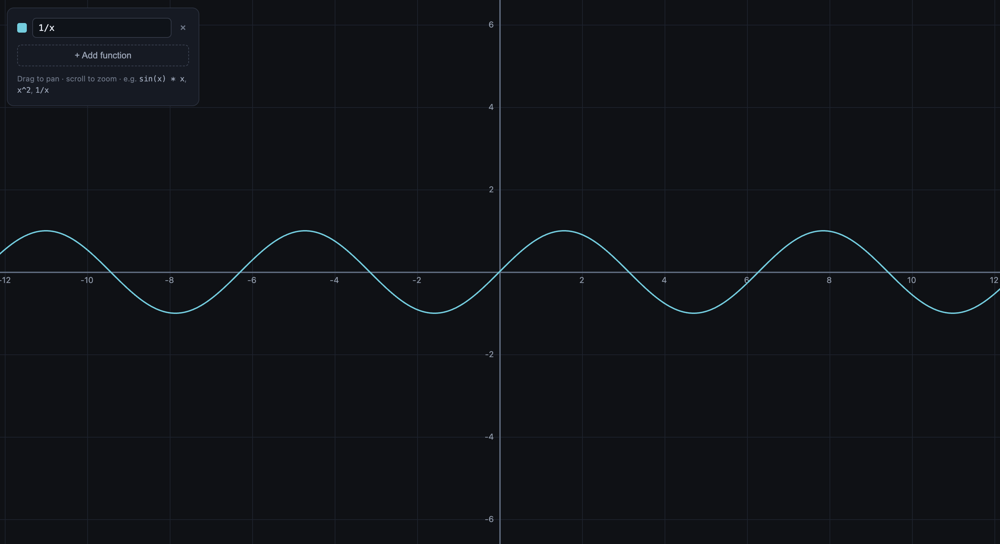

# Graphunc

A full-screen, dependency-free math function grapher built with plain HTML, CSS and JavaScript.



## Setup

No build step. Open `index.html` directly, or serve the folder over HTTP:

```bash
python3 -m http.server
# then open http://localhost:8000
```

## Features

- Full-screen cartesian grid with adaptive tick spacing (1/2/5 × 10ⁿ)
- Pan (drag) and zoom (scroll, anchored under the cursor)
- Plot multiple functions at once, each with its own color
- Live cursor readout: world coordinates plus each function's value, with a marker dot on every curve
- Safe expression parser — recursive descent, **no `eval`** — so user input never executes arbitrary code
- HiDPI/Retina-crisp rendering

## Expression syntax

- Operators: `+ - * / ^` (`^` is right-associative) and unary minus
- Variable: `x` · Constants: `pi`, `e`, `tau`
- Functions: `sin cos tan asin acos atan sinh cosh tanh sqrt cbrt abs exp ln log log2 floor ceil round sign`
- No implicit multiplication — write `3*x`, not `3x`

Examples: `sin(x) * x`, `x^2`, `1/x`, `sqrt(x)`

## Project structure

```
index.html    # Markup: canvas, readout, function panel
styles.css    # Layout and panel styling
parser.js     # Safe expression compiler (compileExpression)
main.js       # Coordinate transforms, rendering, pan/zoom, UI
```
